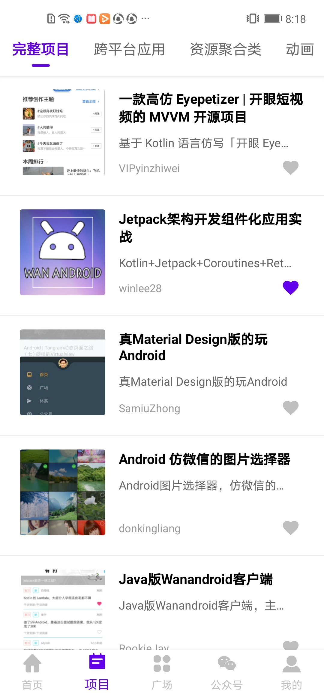
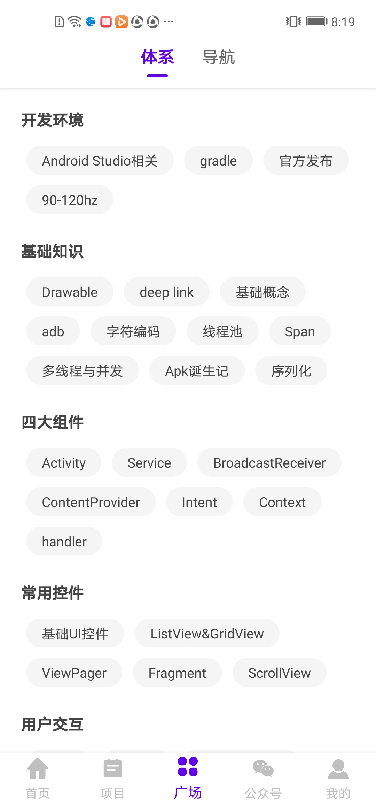
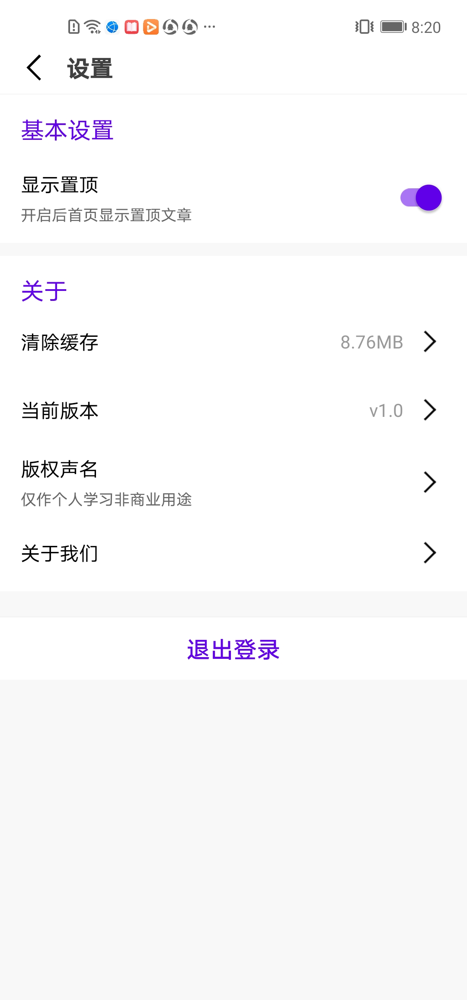

## 简介

[![Platform][1]][2]  [![Release][3]][4]

[1]:https://img.shields.io/badge/platform-Android-blue.svg  
[2]:https://github.com/Jsonjia/zjp-wandroid-master/

[3]:https://img.shields.io/badge/API-21%2B-brightgreen.svg?style=flat
[4]:https://android-arsenal.com/api?level=21


如果这里效果图加载不出来的话，请看[简书介绍](https://www.jianshu.com/p/e6b743f809df)

该项目用了[玩Android](https://www.wanandroid.com/blog/show/2)网站提供的API进行开发而成；项目基于`组件化` + `Arouter` + `MVVM` + `Jetpack` + `Rxjava` + `Retrofit` + `DataBinding` + `AOP` 等框架，如有任何疑问或者bug，可以给我提[Issues](https://github.com/Jsonjia/zjp-wandroid-master/issues)，项目可能迭代维护，努力打造一款优秀的 WanAndroid 客户端。 开源不易，喜欢请个star，谢谢

## 效果图

|  |  |  |  |
| --- | --- | --- | --- |
|  |  |  |  |
|  |  |  |  | 

## App下载
- 点击[](https://github.com/Jsonjia/zjp-wandroid-master/blob/master/app/release/app-release.apk) 下载
- [fir.im下载](http://d.firim.info/24u9)
- 扫码


## 主要功能

- 首页、项目、广场、公众号、我的五大模块；
- 登录注册之间切换动画仿照汽车之家效果；
- 我的模块仿照百度外卖个人中心实现水波纹效果；
- 搜索功能（转场动画）：热门搜索、搜索历史；
- 收藏功能：添加收藏、取消收藏；
- 文章列表快速置顶功能；
- 积分功能 积分排行 积分获取记录以及用户中心动画
- 浏览文章、分享文章、用浏览器打开文章；

## 主要开源框架

- [RxJava](https://github.com/ReactiveX/RxJava)
- [RxAndroid](https://github.com/ReactiveX/RxAndroid)
- [Retrofit](https://github.com/square/retrofit)
- [okhttp](https://github.com/square/okhttp)
- [Glide](https://github.com/bumptech/glide)
- [BRVH](https://github.com/CymChad/BaseRecyclerViewAdapterHelper)
- [EventBus](https://github.com/greenrobot/EventBus)
- [Arouter](https://github.com/alibaba/ARouter)
- [ImmersionBar](https://github.com/gyf-dev/ImmersionBar)
- [Particle](https://github.com/JeasonWong/Particle)
- [banner](https://github.com/youth5201314/banner)
- [LoadSir](https://github.com/KingJA/LoadSir)
- [MagicIndicator](https://github.com/hackware1993/MagicIndicator)
- [AndroidUtilCode](https://github.com/Blankj/AndroidUtilCode)
- [MMKV](https://github.com/Tencent/MMKV)
- [SmartRefreshLayout](https://github.com/scwang90/SmartRefreshLayout)
- [AgentWeb](https://github.com/Justson/AgentWeb)
- [aop](https://github.com/HujiangTechnology/gradle_plugin_android_aspectjx)
- [PersistentCookieJar](https://github.com/franmontiel/PersistentCookieJar)


## 更新日志

**[最新更新日志请点击查看](https://github.com/Jsonjia/zjp-wandroid-master/releases)**

**v1.2.0 (2020-09-19)**

- 1.fix tab导航点击事件和公众号tab文章列表跳转无效问题
- 2.fix文章详情标题出现转义符问题；
- 3.fix fragment切换重叠问题
- 4.优化了公众号文章列表切换显示问题；
- 5.更新了constraintlayout版本号为2.0.1，弃用测试版等；


**v1.0.0 (2020-08-24)**

- 初始化版本，主要功能都已经完成。

## 感谢
- [阿里矢量图](https://www.iconfont.cn/)
- [花瓣](https://huaban.com/)
- 特别感谢我公司的UI妹子，一些好看的图标都是找她切的


## LICENSE

```
Copyright (c) 2020 zjp

Licensed under the Apache License, Version 2.0 (the "License");
you may not use this file except in compliance with the License.
You may obtain a copy of the License at

   http://www.apache.org/licenses/LICENSE-2.0

Unless required by applicable law or agreed to in writing, software
distributed under the License is distributed on an "AS IS" BASIS,
WITHOUT WARRANTIES OR CONDITIONS OF ANY KIND, either express or implied.
See the License for the specific language governing permissions and
limitations under the License.
```
